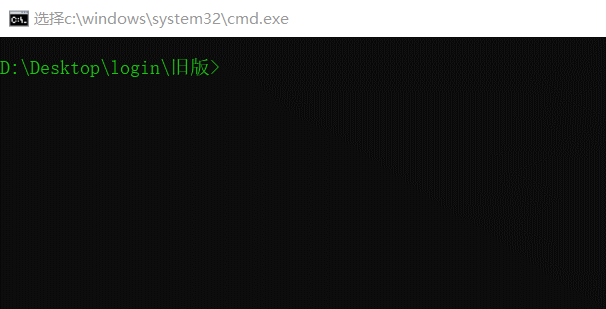
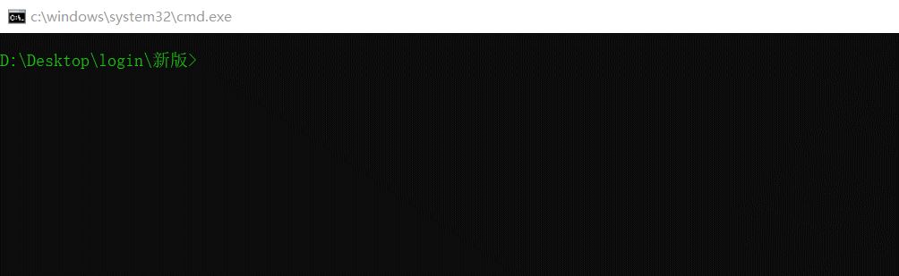

# CsuftJwc
教务处爬虫

## 环境

**python 3.6.5（>=3.5就行）**

**各种第三方库（运行过程中需要什么库安装什么库）**

## 旧版

旧版的教务系统是高校常用的正方教务系统，难点是验证码识别，我直接用了已有的轮子：[正方教务系统验证码识别工具](https://github.com/sctpan/CheckCodeRecognition)

目前实现的功能是查课表，查所有成绩，查等级考试成绩，没有实现自动教学质量评价功能。

## 新版

新版的教务系统是学校外包给湖南强智科技的，没有验证码识别（网页源代码中有这个字段，但还没有使用），比较简单。

目前实现的功能是查本学期成绩，查等级考试成绩。

## Example

### Old

### New

**PS：一个有趣的应用是，对于新版的教务系统（目前还没有教学质量评价），如果学校教务处连外网，就可以用服务器监控自己的成绩单，一旦有老师新上传了成绩，就可以通过邮件第一时间得知自己的成绩。**